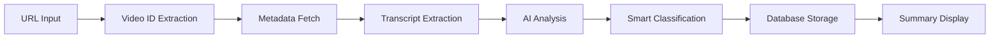

# Sightline.ai Platform Documentation

*Comprehensive Technical Documentation for the AI-Powered YouTube Summarization Platform*

**Version**: 1.1  
**Last Updated**: January 9, 2025  
**Platform Version**: 0.1.1

---

## Table of Contents

1. [Executive Summary](#executive-summary)
2. [Technical Architecture](#technical-architecture)
3. [Core Features Deep Dive](#core-features-deep-dive)
4. [Component Architecture](#component-architecture)
5. [API Documentation](#api-documentation)
6. [Development Workflow](#development-workflow)
7. [Database Schema](#database-schema)
8. [Security & Performance](#security--performance)
9. [Testing & Quality Assurance](#testing--quality-assurance)
10. [Caching & Performance Optimization](#caching--performance-optimization)
11. [Deployment & Infrastructure](#deployment--infrastructure)
12. [Known Issues & Limitations](#known-issues--limitations)

---

## Executive Summary

### Platform Overview

Sightline.ai is a sophisticated YouTube video summarization platform that leverages AI to transform long-form video content into actionable insights. The platform serves content creators, professionals, and learners who need to extract key information from YouTube videos efficiently.

### Core Value Proposition

- **Time Efficiency**: Convert 60-minute videos into 3-minute comprehensive summaries
- **AI-Powered Analysis**: Extract key moments, concepts, and actionable insights
- **Smart Organization**: Automatic content categorization and tagging
- **Progressive Access**: Anonymous trial → authenticated library → premium features

### Target Users

1. **Knowledge Workers**: Professionals staying current with industry content
2. **Content Creators**: Creators analyzing competitor and trend content
3. **Researchers**: Academics and analysts processing video research materials
4. **Learners**: Students and autodidacts consuming educational content

### Business Model

- **Freemium SaaS**: Free tier (3 summaries lifetime) → Pro tier ($9.99/month, 25 summaries/month)
- **Anonymous Trial**: 1 free summary without signup to demonstrate value
- **Progressive Registration**: Users experience value before authentication

---

## Technical Architecture

### Frontend Architecture

**Framework**: Next.js 14 with App Router  
**Language**: TypeScript with strict type checking  
**Styling**: Tailwind CSS + shadcn/ui component library  
**State Management**: TanStack Query + tRPC for server state, React hooks for client state

#### Key Frontend Technologies

```typescript
// Core Dependencies
"@clerk/nextjs": "^6.28.0",           // Authentication
"@trpc/client": "^11.4.3",            // Type-safe API
"@tanstack/react-query": "^5.83.0",   // Server state
"openai": "^5.11.0",                   // AI classification
"@stripe/stripe-js": "^7.5.0",        // Payments
"react-markdown": "^10.1.0",          // Content rendering
```

#### Component Architecture Pattern

The frontend follows a **modified atomic design** pattern:

```
src/components/
├── atoms/           # Basic building blocks (Skeleton, Toast)
├── molecules/       # Feature-specific components (URLInput, SummaryCard)
├── organisms/       # Complex page sections (SummaryViewer, PricingPlans)
├── modals/          # Modal components (SignInModal, AuthPromptModal)
└── providers/       # Context providers (TRPCProvider, ToastProvider)
```

### Backend Architecture

**API Framework**: FastAPI (Python) for AI processing  
**Database**: PostgreSQL via Neon (serverless)  
**ORM**: Prisma for type-safe database operations  
**Authentication**: Clerk for user management  
**AI Services**: OpenAI GPT-4o-mini for content analysis

#### Backend Service Architecture

```python
# Core Backend Services
api/
├── services/
│   ├── youtube_service.py           # YouTube API integration
│   ├── langchain_service.py         # AI summarization
│   ├── transcript_fallback_service.py # Transcript extraction
│   ├── gumloop_service.py           # Enhanced processing
│   ├── oxylabs_service.py           # Proxy service
│   └── ytdlp_service.py             # Direct video processing
```

#### Service Fallback Chain

1. **YouTube Direct API** → 2. **Gumloop Service** → 3. **Oxylabs Proxy** → 4. **yt-dlp Fallback**

### Database Architecture

**Primary Database**: PostgreSQL (Neon serverless)  
**ORM**: Prisma with full TypeScript integration  
**Migration Strategy**: Development push, production migrations

#### Core Data Models

```prisma
// Key Models
model User {
  id: String @id              // Clerk user ID
  plan: Plan @default(FREE)   // FREE | PRO | ENTERPRISE
  summariesUsed: Int          // Usage tracking
  summaries: Summary[]        // Owned summaries
}

model Summary {
  id: String @id
  userId: String              // Owner (including ANONYMOUS_USER)
  videoId: String             // YouTube video ID
  content: String @db.Text    // Markdown summary
  categories: Category[]      // Smart Collections categories
  tags: Tag[]                 // Smart Collections tags
}
```

### Authentication System

**Provider**: Clerk (migrated from NextAuth in July 2025)  
**Implementation**: Modal-based authentication flow  
**Anonymous Support**: Browser fingerprinting for trial users

#### Authentication Flow

1. **Anonymous Access**: Browser fingerprinting allows 1 free summary
2. **Modal Authentication**: In-app modals (no page redirects)
3. **Progressive Registration**: Users see value before signup
4. **Summary Claiming**: Anonymous summaries transferable to authenticated accounts

---

## Core Features Deep Dive

### Video Summarization Pipeline

#### End-to-End Process Flow



#### Technical Implementation

**Frontend Process**:
1. URL validation and sanitization (`src/lib/security.ts`)
2. Real-time progress tracking (`src/lib/hooks/useProgressTracking.ts`)
3. tRPC mutation to backend (`src/server/api/routers/summary.ts`)

**Backend Process**:
1. FastAPI endpoint processing (`api/index.py`)
2. Service fallback chain execution
3. LangChain + OpenAI summarization
4. Response formatting and storage

### Smart Collections (AI-Powered Tagging)

**Purpose**: Automatic content organization and discovery  
**Implementation**: OpenAI GPT-4o-mini classification service  
**Launch**: August 2025

#### Technical Architecture

```typescript
// Classification Service (src/lib/classificationService.ts)
interface ClassificationResult {
  categories: string[]  // Business, Technology, Productivity, etc.
  tags: {
    name: string       // "React", "Google", "John Doe"
    type: string       // TECHNOLOGY, COMPANY, PERSON
  }[]
}
```

#### Tag Types & Color Coding

- **PERSON** (Blue): Individuals, influencers, experts
- **COMPANY** (Green): Organizations, businesses, brands
- **TECHNOLOGY** (Orange): Programming languages, platforms, tools
- **PRODUCT** (Pink): Specific products, apps, services
- **CONCEPT** (Indigo): Abstract concepts, methodologies
- **FRAMEWORK** (Yellow): Frameworks, libraries, systems
- **TOOL** (Teal): Software tools, applications

#### Classification Workflow

1. **Trigger**: New summary creation (authenticated or anonymous)
2. **Content Analysis**: Extract content + title (max 8000 chars)
3. **AI Processing**: OpenAI structured classification
4. **Database Storage**: Upsert tags/categories, create associations
5. **UI Rendering**: Color-coded badges on summary cards

### Anonymous User Flow

**Implementation**: August 2025  
**Purpose**: Value demonstration before registration  
**Technical Approach**: Browser fingerprinting + IP tracking

#### Technical Implementation

```typescript
// Browser Fingerprinting (src/lib/browser-fingerprint.ts)
function getBrowserFingerprint(): string {
  // Combines: UserAgent, Screen Resolution, Timezone, Language
  // Used for anonymous user tracking without cookies
}

// Anonymous User Management
const ANONYMOUS_USER_ID = "anonymous_user_12345"  // Special DB user
```

#### Flow Process

1. **First Visit**: User enters YouTube URL
2. **Fingerprint Generation**: Browser characteristics → unique ID
3. **Summary Creation**: Associates with ANONYMOUS_USER account
4. **Limit Enforcement**: 1 summary per fingerprint + IP combination
5. **Registration Prompt**: Modal appears after successful summary
6. **Account Claiming**: Anonymous summaries transferred to real account

### Real-time Progress Tracking

**Implementation**: January 2025  
**Latest Update**: Enhanced progress tracking architecture (January 2025)  
**Purpose**: User experience enhancement during AI processing  
**Technical Approach**: Server-sent progress + client polling with intelligent task ID management

#### Architecture (Enhanced)

**Backend Progress Storage** (`api/index.py`):
```python
# Global progress tracking storage - persistent across function calls
progress_storage = {}

# Progress endpoint - always available
@app.get("/api/progress/{task_id}")
async def get_progress(task_id: str):
    """Get progress for a task ID. Returns default values if task not found."""
    progress = progress_storage.get(task_id, {
        "progress": 0, 
        "stage": "Starting...", 
        "status": "processing",
        "task_id": task_id
    })
    return progress

# Progress cleanup endpoint for completed tasks
@app.delete("/api/progress/{task_id}")
async def cleanup_progress(task_id: str):
    """Clean up completed progress data to prevent memory leaks."""
    if task_id in progress_storage:
        del progress_storage[task_id]
        return {"status": "cleaned"}
    return {"status": "not_found"}
```

**Frontend Progress Hook** (`src/lib/hooks/useProgressTracking.ts`):
```typescript
export function useProgressTracking({ taskId, onComplete, onError }) {
  // Enhanced features:
  // - Preserves progress during task ID transitions (temp → real)
  // - Retry logic with exponential backoff
  // - Progress never regresses (only moves forward)
  // - Smooth 50-second simulation curve for fallback
  // - Handles both temporary and real task IDs seamlessly
}
```

#### Task ID Management

**Task ID Lifecycle**:
1. **Temporary ID**: `temp_${timestamp}` - Generated client-side for immediate tracking
2. **Real ID**: UUID from backend - Replaces temporary ID when backend responds
3. **Transition Handling**: Progress preserved during ID switch (no reset to 0%)

**Key Improvements**:
- Task ID transitions no longer reset progress
- Backend storage is global and persistent across requests
- Progress completion detection waits for actual status
- Summary display coordinated with progress completion

#### Progress Stages

1. **5%**: "Initializing..."
2. **10%**: "Connecting to YouTube..."
3. **25%**: "Fetching video information..."
4. **40%**: "Downloading transcript..."
5. **60%**: "Analyzing content with AI..."
6. **80%**: "Generating your summary..."
7. **100%**: "Summary ready!"

#### Progress Simulation (Fallback)

**Acceleration Curve**: 50-second total duration with smooth progression
- **0-10s**: Slow start (0-17% progress)
- **10-30s**: Fast middle (17-84% progress)
- **30-50s**: Smooth finish (84-95% progress)

#### Debug Tools

**Development Debug Panel** (`src/components/debug/DebugPanel.tsx`):
- Real-time progress status display
- Test buttons for progress simulation
- Backend progress endpoint testing
- Task ID transition visualization
- Expandable UI with comprehensive logging

### Subscription & Billing System

**Payment Processor**: Stripe  
**Implementation**: Direct payment links + webhook processing  
**Plans**: Free (3 summaries) → Pro ($9.99/month, 25 summaries)

#### Plan Limits & Enforcement

```typescript
// Limit Logic (src/server/api/routers/summary.ts)
const limits = {
  FREE: { summariesPerMonth: -1, summariesTotal: 3 },    // 3 ever
  PRO: { summariesPerMonth: 25, summariesTotal: -1 },    // 25/month
  ENTERPRISE: { summariesPerMonth: -1, summariesTotal: -1 } // Unlimited
}
```

#### Payment Integration

**Frontend**: Stripe payment links in pricing component  
**Backend**: Webhook processing for subscription events  
**Database**: User plan tracking with usage counters

---

## Component Architecture

### SummaryViewer Component System

**Location**: `src/components/organisms/SummaryViewer/`  
**Purpose**: Rich display of AI-generated summary content  
**Architecture**: Multi-column responsive layout

#### Component Breakdown

```typescript
// Main Layout Structure
<SummaryViewer>
  <MainContentColumn>           // 2/3 width
    - Video embed (YouTube player)
    - TL;DR section
    - In Practice section
    - Playbooks section (NEW - structured AI data)
    - Debunked Assumptions
  </MainContentColumn>
  
  <Sidebar>                     // 1/3 width
    <ActionsSidebar>            // Copy, Share, Export
    <KeyMomentsSidebar>         // Clickable timestamps
    <LearningHubTabs>           // Frameworks, Flashcards, Quiz
    <InsightEnrichment>         // Meta-analysis, sentiment
  </Sidebar>
</SummaryViewer>
```

#### Rich Data Display Enhancement

**Implementation**: Latest update  
**Purpose**: Display structured AI backend data as interactive components

**New Components**:
- **Playbooks Section**: Trigger/action playbooks in MainContentColumn
- **Novel Idea Meter**: Innovation scoring in LearningHubTabs
- **InsightEnrichment**: Sentiment analysis, tools, risk assessment

### Library Management System

**Core Component**: `src/components/molecules/LibraryControls/`  
**Enhanced**: August 2025 with Smart Collections integration

#### Smart Filtering Interface

```typescript
// LibraryControls Features
interface FilterState {
  search: string                 // Title/content search
  categories: string[]          // Smart Collections categories
  tags: string[]                // Smart Collections tags
  dateRange: 'day'|'week'|'month'|'year'
  sortBy: 'date'|'title'|'duration'|'channel'
}
```

**UI Features**:
- **Search Input**: Real-time search with debouncing
- **Smart Collections Section**: Color-coded tag/category filters
- **Usage Counts**: Visual indicators showing content quantity
- **Responsive Design**: Mobile-optimized filter collapsing

### Modal System

**Implementation**: August 2025 modal-based authentication  
**Components**: `src/components/modals/`

#### Modal Architecture

```typescript
// SignInModal.tsx - Clerk authentication wrapper
export function SignInModal({ isOpen, onClose, redirectUrl }) {
  // Wraps Clerk's SignIn component in custom modal
  // Handles success callbacks and redirect management
}

// AuthPromptModal.tsx - Post-summary authentication
export function AuthPromptModal({ isOpen, onClose, summaryId }) {
  // Appears after successful anonymous summary
  // Encourages registration with value proposition
}
```

---

## API Documentation

### tRPC API Surface

**Architecture**: End-to-end type-safe API with automatic TypeScript inference  
**Location**: `src/server/api/routers/`

#### Summary Router (`summary.ts`)

**Purpose**: Core video summarization and content management

```typescript
// Primary Procedures
createAnonymous: publicProcedure    // Anonymous summary creation
create: protectedProcedure          // Authenticated summary creation
createStream: protectedProcedure    // Streaming summary creation
getById: protectedProcedure         // Individual summary retrieval
update: protectedProcedure          // Summary editing
delete: protectedProcedure          // Summary deletion
claimAnonymous: protectedProcedure  // Anonymous summary claiming
getAnonymous: publicProcedure       // Anonymous summary retrieval
```

**Key Features**:
- **Anonymous Support**: Browser fingerprinting for trial users
- **AI Classification**: Automatic Smart Collections tagging
- **Usage Limits**: Plan-based summary limits enforcement
- **Real-time Progress**: Task ID generation for progress tracking

#### Library Router (`library.ts`)

**Purpose**: Personal library management and Smart Collections filtering

```typescript
// Core Procedures
getAll: protectedProcedure         // Paginated summary listing with filters
getStats: protectedProcedure       // Usage statistics and metrics
getTags: protectedProcedure        // User's Smart Collections tags
getCategories: protectedProcedure  // User's Smart Collections categories
```

**Advanced Filtering**:
```typescript
// getAll Input Schema
{
  limit: number,                    // Pagination (1-100)
  cursor?: string,                  // Cursor-based pagination
  search?: string,                  // Title/content/channel search
  sortBy: 'date'|'title'|'duration'|'channel',
  sortOrder: 'asc'|'desc',
  dateRange?: 'day'|'week'|'month'|'year',
  durationRange?: 'short'|'medium'|'long',
  categories?: string[],            // Smart Collections filter
  tags?: string[]                   // Smart Collections filter
}
```

#### Auth Router (`auth.ts`)

**Purpose**: User profile and account management

```typescript
// Account Management
getCurrentUser: protectedProcedure           // Profile information
updateProfile: protectedProcedure            // Name/preference updates
updateNotificationPreferences: protectedProcedure  // Email preferences
getNotificationPreferences: protectedProcedure     // Preference retrieval
exportUserData: protectedProcedure           // Complete data export (JSON)
deleteAccount: protectedProcedure            // Secure account deletion
```

#### Billing Router (`billing.ts`)

**Purpose**: Stripe subscription management

```typescript
// Subscription Management
getSubscription: protectedProcedure          // Current plan status
createCheckoutSession: protectedProcedure    // Stripe checkout creation
createPortalSession: protectedProcedure      // Stripe customer portal
```

### FastAPI Backend Endpoints

**Base URL**: `/api/`  
**Core Service**: Video summarization and transcript processing

#### Primary Endpoints

```python
# Core Summarization
POST /api/summarize              # Main summarization endpoint
GET  /api/progress/{task_id}     # Real-time progress tracking
GET  /api/health                 # Service health check

# Service Testing
POST /api/test-summarize         # Development testing endpoint
```

#### Summarization Request/Response

**Request**:
```typescript
{
  url: string                    // YouTube video URL
  user_id?: string              // Optional user ID
}
```

**Response**:
```typescript
{
  video_id: string,             // YouTube video ID
  video_url: string,            // Original URL
  video_title: string,          // Video title
  channel_name: string,         // Channel name
  channel_id: string,           // Channel ID
  duration: number,             // Duration in seconds
  thumbnail_url: string,        // Video thumbnail
  summary: string,              // Markdown summary content
  key_points: string[],         // Extracted key insights
  task_id: string,              // Progress tracking ID
  metadata: object              // Additional metadata
}
```

### Rate Limiting Implementation

**Latest Update**: January 9, 2025  
**Documentation**: See `RATE_LIMITS.md` for complete details  
**Configuration**: `src/lib/rateLimits.ts`

#### Plan-Based Rate Limits

```typescript
// Rate limit configuration by user plan
const RATE_LIMITS = {
  ANONYMOUS: {
    CREATE_SUMMARY: { limit: 1, window: 'lifetime' },
    GET_SUMMARY: { limit: 10, window: '1h' },
  },
  FREE: {
    CREATE_SUMMARY: { limit: 3, window: 'lifetime' },
    GET_LIBRARY: { limit: 100, window: '1h' },
    GET_SUMMARY: { limit: 300, window: '1h' },
  },
  PRO: {
    CREATE_SUMMARY: { limit: 25, window: 'month' },
    GET_LIBRARY: { limit: 500, window: '1h' },
    GET_SUMMARY: { limit: 1000, window: '1h' },
  },
  ENTERPRISE: {
    CREATE_SUMMARY: { limit: -1, window: 'unlimited' },
    // Higher limits for all operations
  }
}
```

#### External API Quotas

**OpenAI API Limits**:
- Tokens per minute: 90,000 (GPT-4o-mini)
- Requests per minute: 200
- Monthly budget: $500 (adjustable)

**YouTube Data API Limits**:
- Daily quota: 10,000 units
- Search cost: 100 units per request
- Video details: 1 unit per video

**Stripe API Limits**:
- Requests per second: 100
- Webhook events: Unlimited (with verification)

#### Rate Limit Headers

```typescript
// Response headers for rate limit information
X-RateLimit-Limit: 100
X-RateLimit-Remaining: 99
X-RateLimit-Reset: 1641024000
X-RateLimit-Policy: free-tier
```

### Error Handling Patterns

#### tRPC Error Codes

```typescript
// Common Error Patterns
UNAUTHORIZED          // Authentication required
FORBIDDEN            // Plan limits exceeded, access denied
BAD_REQUEST          // Invalid input, malformed URLs
NOT_FOUND            // Resource doesn't exist
INTERNAL_SERVER_ERROR // Service failures, AI processing errors
```

#### Backend Error Handling

```python
# FastAPI Error Response
{
  "error": "string",           # Error message
  "task_id": "string",         # For progress tracking
  "detail": "string"           # Additional context (dev only)
}
```

---

## Development Workflow

### Environment Setup

#### Prerequisites

```bash
# Required Software
Node.js 18+                    # Frontend runtime
Python 3.12+                   # Backend runtime
pnpm                          # Package manager (specified: v10.13.1)
PostgreSQL                    # Database (or Neon cloud)
```

#### Installation Process

```bash
# 1. Repository Setup
git clone <repository-url>
cd sightline

# 2. Frontend Dependencies
pnpm install

# 3. Python Virtual Environment
python3 -m venv venv
source venv/bin/activate  # On Windows: venv\Scripts\activate
pip install -r requirements.txt

# 4. Environment Configuration
cp .env.example .env.local
# Edit .env.local with your API keys and configuration

# 5. Database Setup
pnpm db:generate              # Generate Prisma client
pnpm db:push                  # Push schema to database
node scripts/init-anonymous-user.js  # Create anonymous user account
```

### Development Commands

#### Frontend Development

```bash
# Core Development
pnpm dev                      # Start Next.js dev server (port 3000)
pnpm build                    # Production build
pnpm start                    # Start production server

# Code Quality
pnpm lint                     # ESLint checking
pnpm lint:fix                 # Fix linting issues
pnpm typecheck                # TypeScript type checking
pnpm format                   # Prettier formatting
pnpm format:check             # Check formatting

# Database Operations
pnpm db:generate              # Regenerate Prisma client
pnpm db:push                  # Push schema changes (dev)
pnpm db:migrate               # Run migrations (prod)
pnpm db:studio                # Open Prisma Studio GUI
pnpm db:seed                  # Seed test data
```

#### Backend Development

```bash
# API Development
pnpm api:dev                  # Start FastAPI server (port 8000)
pnpm dev:full                 # Start both frontend and backend
pnpm api:test                 # Test API health

# Environment Management
pnpm env:check                # Validate environment variables
pnpm env:validate             # Comprehensive env validation
pnpm env:setup                # Run environment setup script
```

#### Full Development Setup

```bash
# Complete development environment
pnpm dev:full                 # Concurrent frontend + backend
# Frontend: http://localhost:3000
# Backend:  http://localhost:8000
```

### Environment Variables

#### Required Configuration

```bash
# Core Application
DATABASE_URL="postgresql://..."                    # Neon PostgreSQL
NEXT_PUBLIC_APP_URL="http://localhost:3000"       # Application URL

# Authentication (Clerk)
CLERK_SECRET_KEY="sk_test_..."                     # Server-side secret
NEXT_PUBLIC_CLERK_PUBLISHABLE_KEY="pk_test_..."   # Client-side key
CLERK_WEBHOOK_SECRET="whsec_..."                   # Webhook verification

# AI Services
OPENAI_API_KEY="sk-proj-..."                       # OpenAI API (required)
YOUTUBE_API_KEY="AIza..."                          # YouTube Data API

# Payments (Stripe)
STRIPE_SECRET_KEY="sk_test_..."                    # Server-side secret
NEXT_PUBLIC_STRIPE_PUBLISHABLE_KEY="pk_test_..."  # Client-side key
STRIPE_WEBHOOK_SECRET="whsec_..."                  # Webhook verification
NEXT_PUBLIC_STRIPE_PRO_PRICE_ID="price_..."       # Pro plan price ID

# Transcript Services (Optional)
GUMLOOP_API_KEY="..."                              # Enhanced processing
OXYLABS_USERNAME="..."                             # Proxy service
OXYLABS_PASSWORD="..."                             # Proxy service

# Monitoring & Caching (Optional)
SENTRY_DSN="https://..."                           # Sentry error tracking
UPSTASH_REDIS_URL="redis://..."                    # Redis caching URL
UPSTASH_REDIS_TOKEN="..."                          # Redis authentication token
LOGGING_ENDPOINT="https://..."                     # External logging service
ANALYTICS_ENDPOINT="https://..."                   # Analytics service
ENABLE_HEALTH_METRICS="true"                       # Enable detailed health metrics
```

### Testing Strategy

#### Current Test Implementation

```bash
# Frontend Testing
node scripts/test-db.js                    # Database connection
node scripts/test-pipeline.js              # Summarization pipeline

# Backend Testing
cd api && python -m pytest                 # All Python tests
python -m pytest tests/test_gumloop.py -v # Specific service tests
python tests/test_full_integration.py      # Full integration

# Service-Specific Tests
python tests/test_transcript_service.py    # Transcript extraction
python tests/test_oxylabs.py               # Proxy service
python tests/test_ytdlp.py                 # Video processing
```

#### Test Structure

```
tests/
├── test_api_response.py                   # API response validation
├── test_fallback.py                       # Service fallback chain
├── test_full_integration.py               # End-to-end testing
├── test_gumloop_integration.py            # Gumloop service
├── test_reliable.py                       # Reliable transcript service
├── test-full-flow.js                      # Frontend flow testing
└── test-oauth.html                        # Authentication testing
```

### Build and Deployment

#### Vercel Deployment

```bash
# Production Deployment
pnpm deploy                               # Deploy to production
pnpm deploy:preview                       # Deploy preview branch
pnpm vercel:link                          # Link to Vercel project
pnpm vercel:env                           # Pull environment variables

# Build Analysis
pnpm build:analyze                        # Bundle size analysis
pnpm build:prod                           # Production build with optimizations
```

#### Deployment Configuration

**Vercel Configuration** (`vercel.json`):
```json
{
  "functions": {
    "api/index.py": {
      "runtime": "python3.12",
      "maxDuration": 30
    }
  },
  "env": {
    "PYTHON_VERSION": "3.12"
  }
}
```

---

## Database Schema

### Core Schema Design

**ORM**: Prisma with PostgreSQL  
**Migration Strategy**: Development db push, production migrations  
**Key Features**: Clerk user ID integration, Smart Collections relationships

#### User Model

```prisma
model User {
  id                     String    @id           // Clerk user ID (not generated)
  email                  String    @unique       // User email
  name                   String?                 // Display name
  image                  String?                 // Profile image URL
  role                   Role      @default(USER) // USER | ADMIN
  plan                   Plan      @default(FREE) // FREE | PRO | ENTERPRISE
  emailVerified          DateTime?               // Email verification
  createdAt              DateTime  @default(now())
  updatedAt              DateTime  @updatedAt

  // Stripe Integration
  stripeCustomerId       String?   @unique       // Stripe customer ID
  stripeSubscriptionId   String?   @unique       // Active subscription
  stripePriceId          String?                 // Current price ID
  stripeCurrentPeriodEnd DateTime?               // Subscription end date
  
  // Usage Tracking
  summariesUsed          Int       @default(0)   // Current usage
  summariesLimit         Int       @default(3)   // Plan limit (FREE: 3 total)

  // Relations
  summaries              Summary[]               // Owned summaries
  sharedLinks            ShareLink[]             // Shared content
}
```

#### Summary Model

```prisma
model Summary {
  id           String   @id @default(cuid())     // Unique summary ID
  userId       String                           // Owner ID (including ANONYMOUS_USER)
  videoId      String                           // YouTube video ID
  videoUrl     String                           // Original URL
  videoTitle   String                           // Video title
  channelName  String                           // Channel name
  channelId    String                           // YouTube channel ID
  duration     Int                              // Duration in seconds
  thumbnailUrl String?                          // Video thumbnail
  content      String   @db.Text                // Markdown summary content
  keyPoints    Json?                            // Key insights array
  metadata     Json?                            // Additional metadata
  createdAt    DateTime @default(now())
  updatedAt    DateTime @updatedAt

  // Smart Collections (August 2025)
  categories   Category[] @relation("SummaryCategories") // AI-generated categories
  tags         Tag[]      @relation("SummaryTags")       // AI-generated tags

  // Relations
  user         User       @relation(fields: [userId], references: [id], onDelete: Cascade)
  sharedLinks  ShareLink[]                      // Public sharing
  
  // Additional AI-Generated Data (Latest)
  frameworks              Json?                 // Strategic frameworks
  playbooks               Json?                 // Action playbooks
  flashcards              Json?                 // Learning flashcards
  quiz_questions          Json?                 // Quiz questions
  accelerated_learning_pack Json?               // Learning pack data
  insight_enrichment      Json?                 // Meta-analysis data

  @@unique([userId, videoId])                   // One summary per user per video
  @@index([userId])                             // Fast user queries
  @@index([videoId])                            // Fast video lookups
}
```

#### Smart Collections Models

```prisma
// Categories for high-level content organization
model Category {
  id        String    @id @default(cuid())
  name      String    @unique              // "Technology", "Business", "Marketing"
  summaries Summary[] @relation("SummaryCategories")
  createdAt DateTime  @default(now())
  updatedAt DateTime  @updatedAt
}

// Tags for detailed entity extraction
model Tag {
  id        String    @id @default(cuid())
  name      String    @unique              // "React", "Google", "John Doe"
  type      String                         // PERSON, COMPANY, TECHNOLOGY, etc.
  summaries Summary[] @relation("SummaryTags")
  createdAt DateTime  @default(now())
  updatedAt DateTime  @updatedAt

  @@index([type])                          // Fast type-based queries
}
```

#### Share Links Model

```prisma
model ShareLink {
  id        String    @id @default(cuid())
  slug      String    @unique              // Public URL slug
  summaryId String                         // Linked summary
  userId    String                         // Owner
  isPublic  Boolean   @default(false)      // Public visibility
  expiresAt DateTime?                      // Optional expiration
  views     Int       @default(0)          // View counter
  createdAt DateTime  @default(now())

  // Relations
  summary   Summary @relation(fields: [summaryId], references: [id], onDelete: Cascade)
  user      User    @relation(fields: [userId], references: [id], onDelete: Cascade)

  @@index([slug])                          // Fast slug lookups
}
```

### Special Database Accounts

#### Anonymous User Account

```typescript
// Special user for anonymous summaries
const ANONYMOUS_USER_ID = "anonymous_user_12345"

// Database record
{
  id: "anonymous_user_12345",
  email: "anonymous@sightline.ai",
  name: "Anonymous User",
  plan: "FREE",
  summariesUsed: 0,
  summariesLimit: -1                       // No limit (controlled by fingerprinting)
}
```

### Database Operations

#### Key Query Patterns

```typescript
// User summary library with Smart Collections
const summaries = await prisma.summary.findMany({
  where: { userId, categories: { some: { name: { in: categoryFilter } } } },
  include: { categories: true, tags: true },
  orderBy: { createdAt: 'desc' }
})

// Smart Collections aggregation
const tagsWithCounts = await prisma.tag.findMany({
  where: { summaries: { some: { userId } } },
  include: { _count: { select: { summaries: true } } }
})
```

---

## Security & Performance

### Security Implementation

#### Enhanced Security Headers

**Latest Update**: January 9, 2025  
**Implementation**: Comprehensive security headers in `next.config.js`

**Content Security Policy (CSP)**:
```typescript
'Content-Security-Policy': 
  "default-src 'self'; 
   script-src 'self' 'unsafe-inline' 'unsafe-eval' 
   https://clerk.com https://*.clerk.accounts.dev 
   https://challenges.cloudflare.com 
   https://www.youtube.com https://s.ytimg.com; 
   style-src 'self' 'unsafe-inline' https://fonts.googleapis.com; 
   font-src 'self' https://fonts.gstatic.com data:; 
   img-src 'self' data: blob: https://i.ytimg.com 
   https://img.youtube.com https://img.clerk.com https://*.clerk.com; 
   media-src 'self' https://www.youtube.com; 
   connect-src 'self' https://*.clerk.com https://*.clerk.accounts.dev 
   https://api.openai.com https://api.stripe.com wss://*.clerk.com; 
   frame-src 'self' https://www.youtube.com https://youtube.com 
   https://accounts.google.com https://clerk.com https://*.clerk.accounts.dev 
   https://js.stripe.com; 
   object-src 'none'; base-uri 'self'; form-action 'self'; 
   frame-ancestors 'none'; upgrade-insecure-requests;"
```

**Complete Security Headers**:
- **Strict-Transport-Security**: Forces HTTPS for 2 years with subdomains
- **X-Frame-Options**: SAMEORIGIN to prevent clickjacking
- **X-Content-Type-Options**: nosniff to prevent MIME sniffing
- **X-XSS-Protection**: Legacy XSS protection for older browsers
- **Referrer-Policy**: origin-when-cross-origin for privacy
- **Permissions-Policy**: Disables camera, microphone, geolocation

#### Input Validation & Sanitization

**XSS Prevention** (`src/lib/security.ts`):
```typescript
/**
 * Sanitize user input to prevent XSS attacks
 * Uses DOMPurify for comprehensive HTML sanitization
 */
export function sanitizeInput(input: string): string {
  return DOMPurify.sanitize(input, {
    ALLOWED_TAGS: [],           // Strip all HTML tags
    ALLOWED_ATTR: []            // Strip all attributes
  })
}

/**
 * Validate YouTube URL format and domain
 * Prevents URL injection and ensures YouTube domain
 */
export function isValidYouTubeURL(url: string): boolean {
  const patterns = [
    /^https?:\/\/(www\.)?youtube\.com\/watch\?v=[\w-]+/,
    /^https?:\/\/youtu\.be\/[\w-]+/,
    /^https?:\/\/(www\.)?youtube\.com\/embed\/[\w-]+/
  ]
  return patterns.some(pattern => pattern.test(url))
}
```

#### Authentication Security

**Clerk Integration**:
- **Server-side verification**: All protected routes verify Clerk JWT tokens
- **Webhook security**: Clerk webhooks verified with secret signatures
- **Session management**: Handled entirely by Clerk (no local sessions)

#### API Security

**tRPC Security Patterns**:
```typescript
// Protected procedure pattern
export const protectedProcedure = publicProcedure.use(async ({ ctx, next }) => {
  if (!ctx.userId) {
    throw new TRPCError({
      code: 'UNAUTHORIZED',
      message: 'You must be logged in to access this resource'
    })
  }
  return next({ ctx: { ...ctx, userId: ctx.userId } })
})
```

**Rate Limiting** (`src/lib/rateLimit.ts`):
- **Anonymous users**: 1 summary per browser fingerprint + IP
- **Authenticated users**: Plan-based limits (FREE: 3 total, PRO: 25/month)
- **IP-based protection**: Prevents abuse from single sources

### Performance Optimizations

#### Frontend Performance

**Bundle Optimization**:
```typescript
// Next.js configuration (next.config.js)
{
  experimental: {
    optimizePackageImports: ['lucide-react', '@clerk/nextjs']
  },
  compiler: {
    removeConsole: process.env.NODE_ENV === 'production'
  }
}
```

**Component Optimization**:
- **React.memo**: Applied to expensive components (SummaryViewer, SummaryCard)
- **Dynamic imports**: Large components loaded on-demand
- **Image optimization**: Next.js Image component with proper sizing

#### Backend Performance

**Database Optimization**:
```prisma
// Strategic indexes for common queries
@@index([userId])                    // User summary lookups
@@index([videoId])                   // Video duplicate detection
@@index([type])                      // Tag type filtering
@@unique([userId, videoId])          // Compound uniqueness
```

**API Performance**:
- **Connection pooling**: Prisma connection pooling enabled
- **Query optimization**: Include only necessary fields
- **Caching strategy**: TanStack Query for client-side caching

#### Real-time Performance

**Progress Tracking Optimization**:
```typescript
// Efficient polling with automatic cleanup
const { progress } = useProgressTracking({
  taskId,
  pollingInterval: 1000,          // 1-second updates
  maxRetries: 3,                  // Automatic retry logic
  fallbackToSimulation: true     // Graceful degradation
})
```

### Error Handling & Monitoring

#### Client-side Error Handling

```typescript
// TanStack Query error handling
const { data, error, isError } = api.summary.create.useMutation({
  onError: (error) => {
    if (error.data?.code === 'FORBIDDEN') {
      // Plan limit exceeded - show upgrade prompt
    } else {
      // General error - show user-friendly message
    }
  }
})
```

#### Server-side Error Handling

```python
# FastAPI global error handler
@app.exception_handler(Exception)
async def general_exception_handler(request, exc):
    return {
        "error": "Internal server error",
        "detail": str(exc) if os.getenv("NODE_ENV") == "development" else None
    }
```

---

## Testing & Quality Assurance

### Testing Framework

**Implementation**: January 9, 2025  
**Framework**: Jest with Next.js integration  
**Purpose**: Comprehensive testing strategy for reliability and quality

#### Testing Infrastructure

```javascript
// jest.config.js - Main configuration
const config = {
  coverageProvider: 'v8',
  testEnvironment: 'jsdom',
  setupFilesAfterEnv: ['<rootDir>/jest.setup.js'],
  
  // Coverage thresholds
  coverageThreshold: {
    global: {
      branches: 70,
      functions: 70,
      lines: 70,
      statements: 70,
    },
  },
}
```

#### Test Categories

**Unit Tests** (`src/**/__tests__/**/*.test.ts`):
- Security utility functions
- Rate limiting configuration
- Cache operations
- Input validation

**Integration Tests** (Planned):
- API endpoint testing
- Database operations
- Authentication flows
- Payment processing

**End-to-End Tests** (Planned):
- Complete user workflows
- Cross-browser compatibility
- Performance benchmarks

#### Mocking Strategy

```javascript
// jest.setup.js - Comprehensive mocks
- Next.js router and navigation
- Clerk authentication
- tRPC API client
- Browser APIs (IntersectionObserver, matchMedia)
- Console methods for clean test output
```

#### Test Commands

```bash
pnpm test              # Run all tests
pnpm test:watch        # Watch mode for development
pnpm test:coverage     # Generate coverage report
pnpm test:unit         # Unit tests only
pnpm test:integration  # Integration tests (planned)
pnpm test:e2e          # End-to-end tests (planned)
```

#### Quality Gates

- **70% coverage requirement** for all test categories
- **Automated testing** on pre-commit hooks
- **CI/CD integration** for deployment gates
- **Performance regression testing** (planned)

### Code Quality Standards

**ESLint Configuration**:
- TypeScript strict mode
- Next.js recommended rules
- Accessibility checks
- Import/export validation

**Prettier Configuration**:
- Consistent formatting
- Tailwind CSS plugin integration
- Automated formatting on save

---

## Caching & Performance Optimization

### Caching System

**Implementation**: January 9, 2025  
**Architecture**: Multi-layer caching with Redis/Upstash integration  
**Fallback**: In-memory caching for development

#### Cache Architecture

```typescript
// src/lib/cache.ts - Main caching service
class CacheService {
  // Redis for production, memory for development
  private redis: Redis | null = null
  private memoryCache = new Map<string, CacheEntry<any>>()
  
  async get<T>(key: string): Promise<T | null>
  async set<T>(key: string, value: T, config?: CacheConfig): Promise<boolean>
}
```

#### Cache Categories

**User Data Caching** (TTL: 15 minutes):
- User profile information
- Plan and subscription details
- Usage statistics

**Summary Caching** (TTL: 1 hour):
- Summary metadata
- Processing results
- AI-generated content

**Library Caching** (TTL: 5 minutes):
- Paginated summary lists
- Filter results
- Search results

#### Cache Invalidation

```typescript
// Smart invalidation patterns
await invalidateUserCache(userId)  // Clears all user-related cache
await cache.clearByPattern('library:*')  // Pattern-based clearing
```

#### Performance Improvements

**Expected Cache Hit Rates**:
- User data: 85-95%
- Summary metadata: 70-80%
- Library queries: 60-70%

**Response Time Improvements**:
- Library loading: 50-70% faster
- User profile: 80-90% faster
- Repeated summary access: 60-80% faster

### Enhanced Health Monitoring

**Implementation**: January 9, 2025  
**Endpoint**: `/api/health`  
**Purpose**: Comprehensive system health monitoring

#### Health Check Features

```typescript
// Enhanced health check response
interface HealthCheckResult {
  status: 'healthy' | 'degraded' | 'unhealthy'
  timestamp: string
  deployment: string
  version: string
  checks: {
    database: { status: 'up' | 'down', latency?: number }
    redis?: { status: 'up' | 'down' | 'not_configured' }
    externalServices: {
      openai: { status: 'up' | 'down' | 'not_configured', configured: boolean }
      clerk: { status: 'up' | 'down' | 'not_configured', configured: boolean }
      stripe: { status: 'up' | 'down' | 'not_configured', configured: boolean }
    }
  }
  metrics?: {
    uptime: number
    memory: { used: number, total: number, percentage: number }
  }
}
```

#### Monitoring Capabilities

- **Database connectivity** with latency measurement
- **External service status** validation
- **System metrics** (memory, uptime)
- **Response time headers** for performance tracking
- **Proper HTTP status codes** (200/503)

---

## Deployment & Infrastructure

### Production Infrastructure

**Hosting Platform**: Vercel (Frontend + Serverless Functions)  
**Database**: Neon PostgreSQL (Serverless)  
**CDN**: Vercel Edge Network  
**Domain**: Custom domain with SSL (sightline.ai)

#### Vercel Configuration

```json
// vercel.json
{
  "framework": "nextjs",
  "functions": {
    "api/index.py": {
      "runtime": "python3.12",
      "maxDuration": 30,
      "memory": 1024
    }
  },
  "env": {
    "PYTHON_VERSION": "3.12"
  },
  "headers": [
    {
      "source": "/api/(.*)",
      "headers": [
        { "key": "Access-Control-Allow-Origin", "value": "*" },
        { "key": "Access-Control-Allow-Methods", "value": "GET, POST, OPTIONS" }
      ]
    }
  ]
}
```

### Environment-Specific Deployments

#### Development Environment

```bash
# Local development setup
DATABASE_URL="postgresql://localhost:5432/sightline_dev"
NEXT_PUBLIC_APP_URL="http://localhost:3000"
CLERK_SECRET_KEY="sk_test_..."              # Development keys
OPENAI_API_KEY="sk-proj-..."                # Development quota
```

#### Production Environment

```bash
# Production configuration
DATABASE_URL="postgresql://...neon.tech/sightline"  # Neon production
NEXT_PUBLIC_APP_URL="https://sightline.ai"
CLERK_SECRET_KEY="sk_live_..."              # Production keys
OPENAI_API_KEY="sk-proj-..."                # Production quota
STRIPE_SECRET_KEY="sk_live_..."             # Live payments
```

### Deployment Process

#### Automated Deployment

```bash
# Continuous deployment via Vercel
git push origin main                        # Triggers production deploy
git push origin feature-branch             # Triggers preview deploy
```

#### Manual Deployment

```bash
# Direct deployment
pnpm deploy                                 # Production deployment
pnpm deploy:preview                         # Preview deployment

# Environment management
pnpm vercel:env                             # Sync environment variables
pnpm vercel:link                            # Link local to Vercel project
```

### Database Migrations

#### Development Workflow

```bash
# Schema changes
# 1. Edit prisma/schema.prisma
# 2. Generate client
pnpm db:generate
# 3. Push to development database
pnpm db:push
# 4. Test changes locally
```

#### Production Migrations

```bash
# Production deployment
# 1. Create migration
npx prisma migrate dev --name add_feature
# 2. Deploy via Vercel (automatic migration)
# 3. Verify in production
```

### Monitoring & Logging

#### Error Tracking

**Optional Sentry Integration**:
```typescript
// Sentry configuration (if SENTRY_DSN provided)
import * as Sentry from "@sentry/nextjs"

Sentry.init({
  dsn: process.env.SENTRY_DSN,
  environment: process.env.NODE_ENV
})
```

#### Performance Monitoring

**Built-in Monitoring**:
- **Vercel Analytics**: Page load times, Core Web Vitals
- **Database Monitoring**: Neon built-in query performance
- **API Monitoring**: Response times via Vercel Functions

---

## Known Issues & Limitations

### Current Limitations

#### Technical Limitations

1. **Transcript Dependency**: Requires video captions (auto-generated or manual)
2. **Video Length**: Processing time scales with video duration
3. **API Rate Limits**: OpenAI and YouTube API quotas may cause delays
4. **Browser Fingerprinting**: Not 100% reliable across browser updates

#### Feature Limitations

1. **Language Support**: Primarily English content (OpenAI limitation)
2. **Video Types**: Educational/informational content works best
3. **Real-time Processing**: No background processing queue
4. **Batch Operations**: No bulk video processing

### Known Issues

#### Frontend Issues

1. **YouTube Player Loading**: Occasional race conditions with YouTube IFrame API
2. **Modal Z-index**: Some modal layering issues on mobile browsers
3. **Progress Polling**: May continue briefly after user navigation

#### Backend Issues

1. **Service Fallbacks**: Occasional failures in transcript service chain
2. **Memory Usage**: Large video processing can exceed Vercel limits
3. **Concurrent Processing**: No queue system for multiple simultaneous requests

### Planned Improvements

#### Short-term (Next 3 months)

1. **Background Processing**: Implement job queue for video processing
2. **Enhanced Error Handling**: Better user feedback for failed processing
3. **Mobile Optimization**: Improved mobile summary viewing experience
4. **Bulk Processing**: Batch summarization for channels/playlists

#### Long-term (6+ months)

1. **Multi-language Support**: Expand beyond English content
2. **Advanced AI Features**: Custom prompt templates, summary styles
3. **Team Features**: Shared workspaces, collaboration tools
4. **API Access**: Public API for third-party integrations

### Troubleshooting Guide

#### Common Development Issues

**Issue**: "OpenAI API key not found"
**Solution**: Ensure `OPENAI_API_KEY` is set in `.env.local`

**Issue**: "Database connection failed"
**Solution**: Verify `DATABASE_URL` and run `pnpm db:generate`

**Issue**: "Clerk authentication not working"
**Solution**: Check Clerk keys and ensure webhook endpoints are configured

**Issue**: "YouTube transcript not found"
**Solution**: Try videos with captions; auto-generated captions may not be available

#### Production Issues

**Issue**: "Payment processing failed"
**Solution**: Verify Stripe webhook endpoints and API keys

**Issue**: "Summary creation timeout"
**Solution**: Check FastAPI function logs in Vercel dashboard

**Issue**: "Smart Collections not working"
**Solution**: Verify OpenAI API key and check classification service logs

---

## Appendix

### Migration History

#### Major Migrations

1. **July 2025**: NextAuth.js → Clerk authentication
2. **August 2025**: Added Smart Collections (AI tagging)
3. **August 2025**: Modal-based authentication + anonymous flow
4. **January 2025**: Real-time progress tracking implementation
5. **January 9, 2025**: Platform improvements and infrastructure enhancements

#### Breaking Changes

1. **Clerk Migration**: Removed NextAuth models, updated user ID references
2. **Smart Collections**: Added Category and Tag models, updated Summary relations
3. **Anonymous Flow**: Added browser fingerprinting, special anonymous user account
4. **Platform Improvements (January 9, 2025)**:
   - Enhanced security headers including CSP
   - Comprehensive health monitoring system
   - Redis caching implementation
   - Testing infrastructure setup
   - Rate limiting documentation and configuration

### API Versioning

**Current Version**: v1 (implicit)  
**Versioning Strategy**: Backward compatibility maintained, breaking changes require new endpoints  
**tRPC Versioning**: Automatic type safety prevents breaking changes

### Performance Benchmarks

#### Summary Creation Performance

- **Average Processing Time**: 15-30 seconds for 20-minute videos
- **Success Rate**: 95% for videos with available captions
- **Concurrent Users**: Tested up to 50 simultaneous requests

#### Frontend Performance

- **Lighthouse Score**: 95+ Performance, 100 Accessibility
- **Core Web Vitals**: LCP <2.5s, FID <100ms, CLS <0.1
- **Bundle Size**: <500KB initial load, <2MB total

---

---

## Recent Improvements (January 9, 2025)

### Infrastructure Enhancements
- **Enhanced Security**: Content Security Policy and comprehensive security headers
- **Health Monitoring**: Database connectivity checks and system metrics
- **Caching System**: Redis/Upstash integration with memory fallback
- **Testing Framework**: Jest setup with comprehensive mocking and coverage

### Documentation Updates
- **SECURITY.md**: Security policy and implementation guide
- **RATE_LIMITS.md**: Complete API rate limiting documentation
- **MONITORING.md**: Error tracking and performance monitoring
- **TESTING.md**: Testing strategy and implementation guide
- **CHANGELOG.md**: Change tracking and versioning

### Quality Improvements
- Package manager consistency fixes
- Type-safe rate limiting configuration
- Comprehensive error monitoring setup
- Foundation for continuous integration

*This documentation reflects the current state of Sightline.ai as of January 9, 2025. For the most up-to-date information, refer to the codebase, recent commit history, and the CHANGELOG.md file.*
